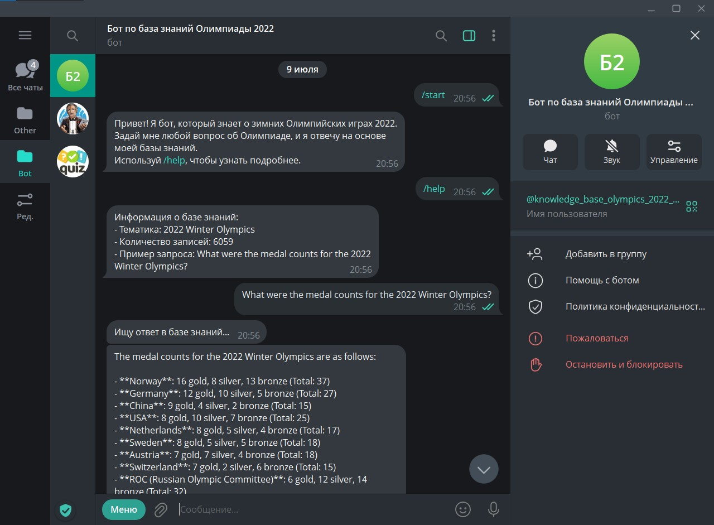
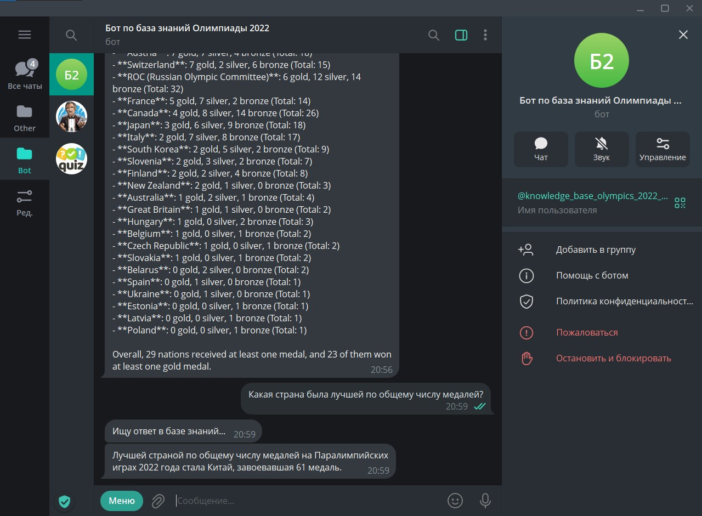

English | [Русский](README.ru.md)

# Knowledge Base Olympics 2022 Bot

A Telegram bot that answers questions about the 2022 Winter Olympics using the
Search-Ask approach: embeddings search + GPT generation.

The bot is live in Telegram: [@knowledge_base_olympics_2022_bot](https://t.me/knowledge_base_olympics_2022_bot)

## How it works

1. The knowledge base is downloaded from the repository (a ZIP archive with
   article texts and embeddings)
2. The user's question is converted to an embedding via `text-embedding-3-small`
3. The most relevant article sections are found by cosine distance
4. Relevant sections are added as context to the GPT-4o-mini prompt
5. The answer is returned to the user

## Business value

An example of a reference-service bot: it answers customers or employees from
company documents instead of a human operator. The same pipeline works for any
document base (FAQ, regulations, product docs).

## Setup

1. Get an OpenAI API key: https://platform.openai.com/api-keys
2. Create a bot via [@BotFather](https://t.me/BotFather) and get the token
3. In Google Colab add secrets (the key icon in the left panel):
   - `M_TOKEN` - OpenAI API key
   - `B_TOKEN` - Telegram bot token
   - `BASE_URL` - `https://api.openai.com/v1`

## How to run

1. Open `knowledge_base_olympics_2022_bot.ipynb` in Google Colab
2. Run all cells
3. Message the bot in Telegram: `/start` or ask any question about the 2022
   Olympics

The knowledge base is downloaded automatically from the repository when the
notebook starts.

## Project structure

- `knowledge_base_olympics_2022_bot.ipynb` - the main bot notebook
- `data/winter_olympics_2022_v3_small.zip` - the knowledge base (archive)
- `requirements.txt` - Python dependencies
- `img/` - screenshots of the bot in action
- `README.md` - this file

## Bot commands

- `/start` - welcome message
- `/help` - knowledge base info (topic, number of records, sample query)
- Any text query - the bot searches the base and returns an answer

## Screenshots

